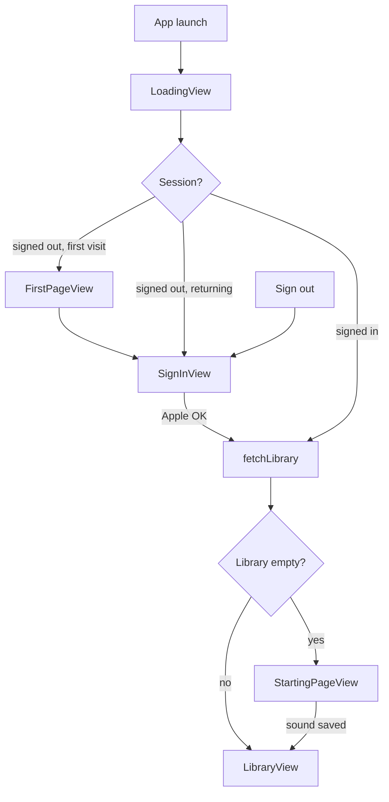
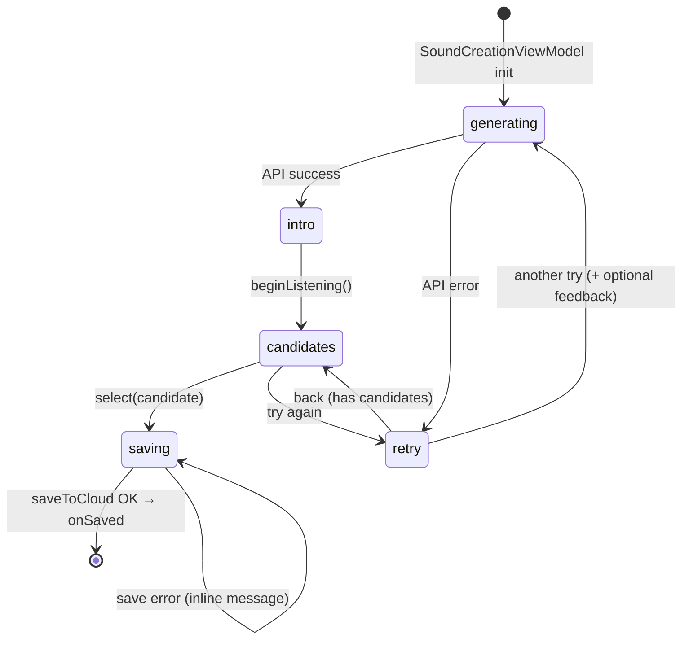

# Elsewhere iOS — Frontend Spec

Companion to [`api-spec.md`](./api-spec.md). Defines navigation, screen states, and data flow so integration stays predictable.

---

## Principles

1. **One root router** — `ContentView` owns auth + library bootstrap; no screen decides “home vs library” on its own.
2. **One conversation entry pattern** — every path into `AIConvoView` uses the same full-screen modal + dismiss contract.
3. **One post-convo state machine** — `SoundCreationViewModel.step` drives all post-conversation UI; views do not branch independently.
4. **Server is source of truth for library** — fetch on sign-in; mutate locally only after successful API writes/deletes.
5. **Errors stay in context** — save failures show on the save screen; generation failures go to retry; never cross-wire the two.

---

## Root navigation



### `AppRoute` (`ContentView`)

| Route | View | When |
|---|---|---|
| `loading` | `LoadingView` | Bootstrapping auth + library |
| `intro` | `FirstPageView` | First launch, not signed in |
| `signIn` | `SignInView` | Sign in / return after sign out |
| `home` | `StartingPageView` | Signed in, library empty |
| `library` | `LibraryView` | Signed in, ≥1 saved sound |

---

## Conversation entry (unified)

Both `StartingPageView` and `LibraryView` present conversation the same way:

```
@State activeConvoSession: ConvoSession?

.fullScreenCover(item: $activeConvoSession) { session in
    NavigationStack {
        AIConvoView(
            mode: session.mode,
            onSavedToLibrary: { sound in
                viewModel.add(sound)   // library only
                activeConvoSession = nil
            },
            onCancel: { activeConvoSession = nil }
        )
        .id(session.id)
    }
}
```

**Do not** push `AIConvoView` via `navigationDestination` — it causes inconsistent back behavior and double stacks.

---

## Post-conversation flow



### Steps → views

| Step | View | Driven by |
|---|---|---|
| `generating` | `SoundGenerationView` | `viewModel.checklist` |
| `intro` | `PostConvoIntroView` | `headerTitle`, `mode` |
| `candidates` | `SoundCandidatesView` | `candidates`, `headerTitle` |
| `saving` | `SavingView` | `selectedCandidate`, `mode`, `saveError` |
| `retry` | `RetryView` | feedback → appended to transcript on retry |

### Retry feedback

When the user taps **another try**, optional feedback is appended as a user transcript message before re-calling `POST /api/sound-candidates`. This keeps regeneration grounded in what felt wrong.

---

## Screen wireframes

### LibraryView (hub)
```
┌─────────────────────────┐
│ {name}'s space      (G) │
│ N sounds · M modes to go│
│ ┌─ mode card ─────── ✕  │
│ │ SLEEP                 │
│ │ the living room       │
│ └───────────────────────┘
│ add card                │
│ WHEN YOU'RE READY       │
│ ┌ RELAX · ...        +  │
└─────────────────────────┘
  tap card → SoundDemoView (push)
  add card → AIConvoView (fullScreenCover)
```

### AIConvoView
```
Close    CONNECTED    Compose
[message feed]
(mic)
→ Compose → PostConvoFlowView (fullScreenCover)
```

### SoundDemoView
```
back to your space
[immersive art + playback]
timer | what's in this | add card → AIConvoView
```

---

## Data flow

### Auth
```
SignInView → AuthViewModel → AuthService → POST /api/auth/apple
Keychain stores access + refresh tokens
APIClient attaches Bearer token; refreshes on 401
```

### Library
```
Sign-in / bootstrap → GET /api/library → SoundLibrary model
Save → POST /api/library → add locally on success
Delete → DELETE /api/library/:id → remove locally on success only
Signed URLs expire (~1h) — re-fetch library before long playback sessions
```

### Sound generation
```
AIConvoView transcript → PostConvoFlowView
  → POST /api/sound-candidates (base64 MP3s written to temp files for preview)
  → user picks candidate → POST /api/library with audioBase64
  → SavedSound with remote audioUrl
```

---

## ViewModels

| ViewModel | Scope | Owns |
|---|---|---|
| `AuthViewModel` | App (`@Environment`) | Session, display name |
| `LibraryViewModel` | App root (`@State` in ContentView) | `SoundLibrary`, fetch/delete |
| `ConversationViewModel` | Per `AIConvoView` | ElevenLabs session, transcript |
| `SoundCreationViewModel` | Per `PostConvoFlowView` | Generation step machine, save |

---

## Integration checklist (frontend engineers)

- [ ] Use `AuthViewModel.displayName` for greetings — never hardcode names
- [ ] Pass `CuratorMode` into `SavingView` — never hardcode mode labels
- [ ] Present `AIConvoView` only via `fullScreenCover` + `ConvoSession`
- [ ] On save from home flow, ContentView sets `route = .library` after `libraryViewModel.add`
- [ ] Handle signed URL expiry — refetch library if playback fails
- [ ] Set URLSession timeout ≥ 60s for sound-candidates
- [ ] Retry feedback must flow into `SoundCreationViewModel.retryGeneration(feedback:)`

---

## Known follow-ups (not yet implemented)

- Real playback state on library cards (vs decorative progress bar)
- FirstPageView preview audio + persona carousel
- SoundDemoView timer / “what’s in this” actions
- User-selectable `activeMode` on library
